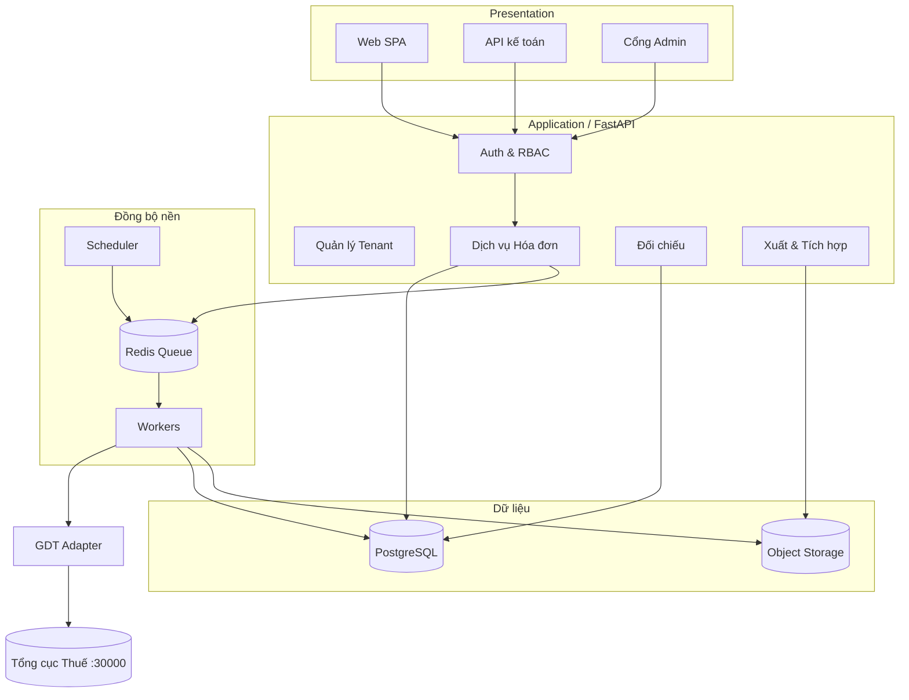

# VATCrawlbot — Kiến trúc & Kế hoạch phát triển chuẩn Enterprise

*Nền tảng tra cứu, đồng bộ và quản trị hóa đơn điện tử kết nối trực tiếp Hệ thống Hóa đơn điện tử của Tổng cục Thuế (`hoadondientu.gdt.gov.vn`).*

Phiên bản tài liệu: 1.0 · Ngày: 11/07/2026 · Trạng thái: Bản kế hoạch nền tảng (MVP đã hiện thực một phần)

---

## 1. Tóm tắt điều hành

Doanh nghiệp Việt Nam đã có tài khoản trên hệ thống của cơ quan thuế để theo dõi hóa đơn đầu ra và đầu vào, nhưng giao diện tra cứu chính thức bộc lộ giới hạn: số trường dữ liệu hiển thị/xuất ra không đủ, thao tác thủ công theo từng tháng, khó đối chiếu và khó tích hợp vào quy trình kế toán. Thị trường vì thế xuất hiện nhiều phần mềm trung gian trả phí đóng vai trò "lớp bọc" quanh API chính thức của Tổng cục Thuế.

VATCrawlbot đặt mục tiêu xây dựng một nền tảng **của chính doanh nghiệp**, kết nối **trực tiếp** tới API chính thức bằng tài khoản Mã số thuế hợp pháp, trích xuất **đầy đủ trường dữ liệu** của hóa đơn thuộc thẩm quyền, chuẩn hóa và lưu trữ có hệ thống, phục vụ đối chiếu – kê khai – nhập kế toán – báo cáo. Kiến trúc được thiết kế để mở rộng từ công cụ nội bộ một doanh nghiệp lên một sản phẩm SaaS đa khách hàng (multi-tenant) có thể thương mại hóa.

Bản MVP hiện tại (thư mục `backend/`, `frontend/`) đã chứng minh được luồng cốt lõi: xác thực qua captcha, truy vấn hóa đơn mua vào/bán ra (bao gồm hóa đơn máy tính tiền), chuẩn hóa dữ liệu và xuất Excel. Tài liệu này đặt MVP đó vào một tổng thể kiến trúc bền vững, có thể bảo trì, mở rộng và thương mại hóa.

---

## 2. Bối cảnh & Cơ sở pháp lý – kỹ thuật

Hệ thống hóa đơn điện tử của Tổng cục Thuế cung cấp một tập API nội bộ mà giao diện web chính thức sử dụng. Các nhóm điểm cuối chính:

| Nhóm | Điểm cuối (base `https://hoadondientu.gdt.gov.vn:30000`) | Mục đích |
|------|----------------------------------------------------------|----------|
| Xác thực | `GET /captcha`, `POST /security-taxpayer/authenticate` | Lấy mã captcha và đổi lấy JWT token |
| HĐ điện tử thường | `GET /query/invoices/purchase`, `/query/invoices/sold` | Hóa đơn mua vào / bán ra |
| HĐ máy tính tiền | `GET /sco-query/invoices/purchase`, `/sco-query/invoices/sold` | Hóa đơn khởi tạo từ máy tính tiền |
| Chi tiết | `GET /query/invoices/detail`, `/sco-query/invoices/detail` | Dòng hàng hóa, thuế suất của từng hóa đơn |

Xác thực dùng chuẩn Bearer token (JWT). Truy vấn dùng cú pháp lọc kiểu RSQL trên trường ngày lập `tdlap` và trạng thái xử lý `ttxly`, phân trang bằng con trỏ `state`.

**Ranh giới pháp lý cần tôn trọng (điều kiện tiên quyết của toàn bộ dự án):**

- Chỉ truy xuất dữ liệu **thuộc thẩm quyền của tài khoản đăng nhập** — tức hóa đơn của chính doanh nghiệp đó. Không dùng để thu thập dữ liệu bên thứ ba.
- Ứng dụng phải **giả lập hành vi người dùng hợp pháp**, không tấn công, không vượt captcha bằng cách phá vỡ cơ chế bảo vệ (captcha do người dùng nhập).
- Với mô hình SaaS, phải có sự **ủy quyền rõ ràng của khách hàng** cho việc truy cập tài khoản thuế của họ, kèm hợp đồng xử lý dữ liệu.
- Tuân thủ pháp luật về bảo vệ dữ liệu cá nhân (Nghị định 13/2023/NĐ-CP) và quy định về hóa đơn điện tử (Nghị định 123/2020/NĐ-CP, Thông tư 78/2021/TT-BTC).

Đây không phải rào cản mà là **nền móng tin cậy** — chính là điểm khác biệt để một sản phẩm "sạch" có thể thương mại hóa lâu dài.

---

## 3. Mục tiêu sản phẩm & Chỉ số thành công

Mục tiêu chức năng cốt lõi: đồng bộ đầy đủ hóa đơn đầu vào/đầu ra với toàn bộ trường dữ liệu (cấp hóa đơn và cấp dòng hàng), lưu trữ lịch sử để tra cứu bất kỳ lúc nào, đối chiếu và phát hiện chênh lệch phục vụ kê khai thuế GTGT, và xuất/đẩy dữ liệu sang phần mềm kế toán.

Chỉ số thành công định lượng gợi ý: tỷ lệ đồng bộ đủ hóa đơn ≥ 99,5% so với đối soát thủ công; thời gian đồng bộ một tháng dữ liệu < 60 giây cho doanh nghiệp cỡ vừa; độ sẵn sàng dịch vụ (uptime) ≥ 99,5%; thời gian khôi phục sau sự cố (RTO) < 4 giờ và mất mát dữ liệu tối đa (RPO) < 15 phút.

---

## 4. Nguyên tắc thiết kế & vận hành

Kiến trúc tuân theo một số nguyên tắc xuyên suốt. **Tách biệt trách nhiệm** giữa lớp kết nối cơ quan thuế (adapter), lớp nghiệp vụ (domain) và lớp trình bày (API/UI) để mỗi phần thay đổi độc lập. **Bất biến và truy vết**: mọi lần đồng bộ được ghi nhật ký (ai, khi nào, khoảng thời gian, kết quả); dữ liệu hóa đơn được lưu kèm bản gốc JSON để đối chiếu về sau. **Idempotent**: đồng bộ lại cùng một khoảng thời gian không tạo bản ghi trùng, nhờ khóa tự nhiên của hóa đơn. **Tối thiểu đặc quyền và tối thiểu lưu trữ nhạy cảm**: không lưu mật khẩu thuế; token có vòng đời ngắn; bí mật được mã hóa. **Khả năng phục hồi**: mọi lệnh gọi ra ngoài có timeout, retry có kiểm soát (exponential backoff), và không làm quá tải máy chủ thuế (rate limit phía client). **Đa khách hàng ngay từ mô hình dữ liệu** để không phải viết lại khi thương mại hóa.

**Khóa tự nhiên của một hóa đơn** (dùng để khử trùng lặp và đồng bộ idempotent): bộ năm trường `(nbmst, khmshdon, khhdon, shdon, tdlap)` — mã số thuế người bán, ký hiệu mẫu số, ký hiệu hóa đơn, số hóa đơn, ngày lập.

---

## 5. Sơ đồ kiến trúc tổng thể

Kiến trúc mục tiêu (bản thương mại hóa) gồm bốn tầng: tầng trình bày, tầng ứng dụng/nghiệp vụ, tầng đồng bộ nền, và tầng dữ liệu — cùng lớp kết nối ra cơ quan thuế.

```
┌──────────────────────────────────────────────────────────────────────────┐
│                         TẦNG TRÌNH BÀY (Presentation)                      │
│   Web SPA (React/Vue)      │   API cho phần mềm kế toán   │   Cổng Admin    │
└───────────────┬───────────────────────┬─────────────────────────┬─────────┘
                │  HTTPS / REST + JWT    │                         │
┌───────────────▼────────────────────────▼─────────────────────────▼─────────┐
│                     TẦNG ỨNG DỤNG / NGHIỆP VỤ (Application)                  │
│  Auth & RBAC │ Quản lý tenant │ Dịch vụ Hóa đơn │ Đối chiếu │ Xuất/Tích hợp  │
│                        (FastAPI — API Gateway nội bộ)                        │
└───────┬───────────────────────────────┬──────────────────────────┬─────────┘
        │ đẩy job                        │ đọc/ghi                   │ audit
┌───────▼───────────┐        ┌───────────▼──────────┐     ┌─────────▼─────────┐
│  TẦNG ĐỒNG BỘ NỀN │        │      TẦNG DỮ LIỆU     │     │  Nhật ký & Giám sát│
│  Worker (Celery/  │        │ PostgreSQL (chính)    │     │  Audit log,        │
│  RQ) + Scheduler  │        │ Object storage (JSON  │     │  Metrics, Tracing  │
│  Hàng đợi (Redis) │        │ gốc, file Excel)      │     │  (Prometheus/ELK)  │
└───────┬───────────┘        └───────────────────────┘     └───────────────────┘
        │ gọi có kiểm soát (rate limit, retry, circuit breaker)
┌───────▼─────────────────────────────────────────────────────────────────────┐
│           LỚP KẾT NỐI CƠ QUAN THUẾ (GDT Adapter — gdt_client.py)             │
│   captcha → authenticate → query purchase/sold → detail (query & sco-query)  │
└───────┬─────────────────────────────────────────────────────────────────────┘
        │ HTTPS
┌───────▼─────────────────────────────────────────────────────────────────────┐
│              Hệ thống Hóa đơn điện tử — Tổng cục Thuế (:30000)                │
└──────────────────────────────────────────────────────────────────────────────┘
```

Cùng nội dung, biểu diễn bằng Mermaid để render trực quan khi cần:



Với **giai đoạn MVP nội bộ một doanh nghiệp**, kiến trúc được rút gọn: FastAPI phục vụ luôn cả frontend, đồng bộ chạy đồng bộ (synchronous) trong request, dữ liệu có thể lưu SQLite/PostgreSQL đơn giản, không cần hàng đợi. Việc tách tầng như trên chỉ kích hoạt khi lên SaaS — nhưng ranh giới module đã được vẽ sẵn từ MVP nên không phải viết lại.

---

## 6. Các thành phần chính

**Lớp kết nối cơ quan thuế (GDT Adapter).** Đóng gói toàn bộ chi tiết giao tiếp với máy chủ thuế: lấy captcha, đăng nhập, dựng chuỗi truy vấn RSQL, phân trang bằng con trỏ `state`, gộp hai họ endpoint (thường và máy tính tiền), khử trùng lặp theo khóa tự nhiên, và lấy chi tiết dòng hàng. Đây là thành phần duy nhất "biết" về cấu trúc API thuế; khi cơ quan thuế đổi endpoint chỉ cần sửa ở đây. (Đã hiện thực trong `backend/gdt_client.py`.)

**Dịch vụ Hóa đơn (Invoice Service).** Điều phối đồng bộ, ánh xạ dữ liệu thô sang mô hình miền chuẩn hóa, ghi vào cơ sở dữ liệu theo cơ chế upsert idempotent, và cung cấp truy vấn/lọc/tổng hợp cho tầng trình bày.

**Đối chiếu (Reconciliation).** So khớp hóa đơn đầu vào với sổ mua hàng/kế toán, phát hiện hóa đơn thiếu, sai lệch tiền thuế, hóa đơn bị hủy/thay thế, hóa đơn của nhà cung cấp có rủi ro. Đây là giá trị gia tăng lớn nhất so với việc chỉ "tải hóa đơn".

**Xuất & Tích hợp (Export & Integration).** Xuất Excel/CSV theo mẫu, và cung cấp API/webhook để phần mềm kế toán (MISA, FAST, Bravo…) kéo dữ liệu. Ánh xạ trường sang định dạng nhập liệu của từng phần mềm.

**Đồng bộ nền (Scheduler + Workers).** Tự động đồng bộ định kỳ (ví dụ mỗi đêm hoặc mỗi giờ), chạy các job dài mà không chặn giao diện, với hàng đợi và retry.

**Quản trị & Bảo mật (Auth, RBAC, Tenant, Audit).** Quản lý người dùng nội bộ của doanh nghiệp, phân quyền theo vai trò (kế toán, kế toán trưởng, quản trị), cách ly dữ liệu giữa các tenant, và ghi nhật ký kiểm toán mọi hành động nhạy cảm.

---

## 7. Mô hình & logic dữ liệu

### 7.1. Các thực thể cốt lõi

Mô hình dữ liệu xoay quanh hóa đơn, với đa khách hàng (tenant) làm trục cách ly. Quan hệ chính:

```
Tenant (1) ──< (N) TaiKhoanThue ──< (N) LanDongBo
Tenant (1) ──< (N) HoaDon (1) ──< (N) DongHangHoa
Tenant (1) ──< (N) NguoiDung
Tenant (1) ──< (N) AuditLog
```

**Tenant** (doanh nghiệp khách hàng): `id`, `ten`, `mst`, `trang_thai`, `goi_dich_vu`, `ngay_tao`.

**TaiKhoanThue** (tài khoản đăng nhập cơ quan thuế của tenant): `id`, `tenant_id`, `username`, `loai` (chính/người dùng con), `secret_ref` (tham chiếu tới bí mật đã mã hóa — **không lưu mật khẩu thô**), `token_hien_tai` (mã hóa, vòng đời ngắn), `token_het_han`.

**HoaDon** (bảng trung tâm): khóa chính nội bộ `id` + **khóa tự nhiên duy nhất** `(tenant_id, nbmst, khmshdon, khhdon, shdon, tdlap)`. Các trường nghiệp vụ đầy đủ: người bán (`nbmst`, `nbten`), người mua (`nmmst`, `nmten`), định danh (`khmshdon`, `khhdon`, `shdon`), thời gian (`tdlap`, `ncnhat`), tiền (`tgtcthue` chưa thuế, `tgtthue` tiền thuế, `tgtttbso` tổng thanh toán, `ttcktmai` chiết khấu, `dvtte` tiền tệ, `tgia` tỷ giá), trạng thái (`ttxly` xử lý, `tthai` hóa đơn), phân loại nội bộ (`chieu` đầu vào/đầu ra, `nguon` thường/máy tính tiền). Kèm cột `raw_json` lưu nguyên bản phản hồi để đối chiếu và không mất dữ liệu khi lược đồ mở rộng.

**DongHangHoa** (chi tiết từng dòng): `id`, `hoadon_id`, `stt`, `ten`, `dvtinh` (đơn vị tính), `sluong` (số lượng), `dgia` (đơn giá), `thtien` (thành tiền), `ltsuat` (thuế suất), `tsuat_tien` (tiền thuế dòng).

**LanDongBo** (nhật ký đồng bộ): `id`, `tenant_id`, `taikhoan_id`, `chieu`, `tu_ngay`, `den_ngay`, `so_hd_moi`, `so_hd_cap_nhat`, `trang_thai`, `thong_diep_loi`, `bat_dau`, `ket_thuc`.

**NguoiDung** và **AuditLog** phục vụ phân quyền và truy vết.

### 7.2. Logic đồng bộ (idempotent upsert)

Với mỗi khoảng thời gian và mỗi chiều (đầu vào/đầu ra), hệ thống truy vấn cả endpoint thường lẫn máy tính tiền, gộp kết quả và khử trùng lặp theo khóa tự nhiên. Mỗi hóa đơn được **upsert**: nếu khóa tự nhiên chưa tồn tại thì chèn mới; nếu đã tồn tại thì cập nhật các trường có thể thay đổi (đặc biệt `ttxly`, `tthai` khi hóa đơn bị điều chỉnh/thay thế/hủy) và ghi đè `raw_json`, đồng thời cập nhật mốc thời gian. Nhờ vậy, đồng bộ lại nhiều lần cùng một tháng là an toàn và luôn phản ánh trạng thái mới nhất.

Chi tiết dòng hàng được lấy theo cơ chế lười (lazy) hoặc theo lô nền: chỉ gọi `detail` khi cần (người dùng mở hóa đơn) hoặc trong job nền để không tạo quá nhiều lệnh gọi tới máy chủ thuế cùng lúc.

### 7.3. Trạng thái xử lý (`ttxly`) và mã hóa

Trường `ttxly` phản ánh trạng thái của hóa đơn trong hệ thống thuế (ví dụ: đã cấp mã, tổng hợp dữ liệu…). Hệ thống lưu cả mã số lẫn nhãn tiếng Việt "đọc được" để phục vụ hiển thị và báo cáo, và cho phép lọc theo tập trạng thái khi đồng bộ.

---

## 8. Bảo mật & tuân thủ

Bảo mật là điều kiện sống còn vì hệ thống chạm tới **tài khoản thuế và dữ liệu tài chính** của doanh nghiệp.

Về **quản lý bí mật**: tuyệt đối không lưu mật khẩu thuế ở dạng thô. Với công cụ nội bộ, mật khẩu chỉ tồn tại trong bộ nhớ đúng lúc đăng nhập. Với SaaS có đồng bộ tự động, nếu buộc phải lưu thông tin đăng nhập để chạy nền, phải mã hóa bằng dịch vụ quản lý khóa (KMS/Vault) với mã hóa cấp trường, khóa xoay định kỳ, và phân tách môi trường. Token JWT do cơ quan thuế cấp được coi là bí mật, lưu mã hóa và có thời hạn ngắn.

Về **kiểm soát truy cập**: xác thực người dùng nội bộ độc lập với tài khoản thuế; phân quyền theo vai trò (RBAC); cách ly dữ liệu đa khách hàng ở tầng truy vấn (mọi truy vấn đều gắn `tenant_id`), cân nhắc Row-Level Security của PostgreSQL. Mọi hành động nhạy cảm (đăng nhập, đồng bộ, xuất dữ liệu, thay đổi cấu hình) được ghi **audit log** bất biến.

Về **truyền và lưu trữ**: bắt buộc HTTPS/TLS toàn tuyến; mã hóa dữ liệu khi lưu (at-rest); giới hạn phạm vi log để không rò rỉ dữ liệu nhạy cảm; ẩn/che (mask) thông tin khi hiển thị nhật ký.

Về **tuân thủ pháp lý**: tôn trọng phạm vi ủy quyền (chỉ dữ liệu của tenant), có hợp đồng xử lý dữ liệu (DPA) với khách hàng SaaS, tuân thủ Nghị định 13/2023/NĐ-CP về bảo vệ dữ liệu cá nhân và các quy định về hóa đơn điện tử. Cần điều khoản dịch vụ nêu rõ hệ thống là công cụ hỗ trợ tra cứu dữ liệu thuộc thẩm quyền của khách hàng, không thay thế nghĩa vụ kê khai của họ.

Về **quan hệ với máy chủ thuế**: áp rate limit phía client, backoff khi bị từ chối, circuit breaker để ngừng gọi khi máy chủ thuế gặp sự cố, nhằm hành xử như một client "lịch sự" và ổn định.

---

## 9. Lưu trữ, sao lưu & khôi phục

Cơ sở dữ liệu chính là PostgreSQL (giao dịch, quan hệ, hỗ trợ JSONB cho `raw_json` và Row-Level Security cho đa khách hàng). Bản gốc JSON dung lượng lớn và file Excel xuất ra lưu ở object storage (ví dụ S3/MinIO) để tách tải khỏi cơ sở dữ liệu.

Chiến lược sao lưu: sao lưu tự động hằng ngày kèm lưu WAL để phục hồi tại thời điểm (PITR), đáp ứng RPO < 15 phút; kiểm thử khôi phục định kỳ (một bản backup không kiểm thử coi như không có). Lưu trữ dài hạn phục vụ nghĩa vụ lưu hóa đơn theo quy định (tối thiểu 10 năm với chứng từ kế toán) bằng tầng lưu trữ lạnh chi phí thấp. Áp dụng vòng đời dữ liệu: dữ liệu nóng (tra cứu thường xuyên) trong PostgreSQL, dữ liệu nguội chuyển sang lưu trữ nén/lạnh.

---

## 10. Bảo trì & vận hành (DevOps)

Mã nguồn quản lý bằng Git với môi trường tách bạch (dev/staging/prod). Đóng gói bằng Docker, triển khai qua CI/CD (chạy kiểm thử tự động, quét bảo mật phụ thuộc, build image, triển khai). Cấu hình qua biến môi trường và kho bí mật, không hard-code.

Về **quan sát hệ thống (observability)**: nhật ký tập trung (ELK/Loki), số liệu (Prometheus + Grafana) cho tỷ lệ lỗi đồng bộ, độ trễ gọi máy chủ thuế, số hóa đơn đồng bộ; truy vết phân tán cho các job dài; cảnh báo khi tỷ lệ lỗi vượt ngưỡng hoặc máy chủ thuế đổi hành vi.

Điểm bảo trì **nhạy cảm nhất** là sự phụ thuộc vào API không chính thức của cơ quan thuế: khi họ thay đổi endpoint, tham số hoặc cơ chế captcha, hệ thống có thể gãy. Giảm thiểu bằng cách cô lập toàn bộ phụ thuộc này trong GDT Adapter, có bộ kiểm thử hợp đồng (contract test) chạy định kỳ để phát hiện sớm thay đổi, và có cảnh báo tự động. Đây phải là ưu tiên giám sát số một.

---

## 11. Khả năng mở rộng (Scalability)

Tầng ứng dụng thiết kế phi trạng thái (stateless) để nhân bản ngang sau bộ cân bằng tải. Công việc nặng (đồng bộ, lấy chi tiết, xuất file lớn) đẩy sang worker nền theo hàng đợi, mở rộng số worker theo tải. Cơ sở dữ liệu mở rộng bằng read-replica cho truy vấn báo cáo, đánh chỉ mục theo `tenant_id` và khóa tự nhiên, và phân vùng (partition) bảng hóa đơn theo thời gian khi dữ liệu lớn.

Điểm nghẽn thực tế không phải hạ tầng của ta mà là **giới hạn tốc độ của máy chủ thuế**. Vì vậy cần điều phối hàng đợi công bằng giữa các tenant (không để một khách hàng lớn làm nghẽn hàng đợi chung), lập lịch đồng bộ giãn theo khung giờ, và cache dữ liệu đã đồng bộ để giảm số lần gọi lại.

---

## 12. Lộ trình phát triển theo giai đoạn

**Giai đoạn 0 — MVP nội bộ (đã có).** Đăng nhập captcha, tra cứu đầu vào/đầu ra (gồm hóa đơn máy tính tiền), xem/lọc/tổng hợp, xuất Excel. Chạy một máy, dữ liệu tạm trong bộ nhớ phiên. Mục tiêu: chứng minh giá trị và luồng kỹ thuật.

**Giai đoạn 1 — Lưu trữ & đồng bộ có hệ thống.** Thêm PostgreSQL, mô hình dữ liệu mục 7, upsert idempotent, nhật ký đồng bộ, lấy chi tiết dòng hàng, lưu `raw_json`. Cho phép tra cứu lịch sử nhiều kỳ mà không cần gọi lại máy chủ thuế.

**Giai đoạn 2 — Tự động hóa & đối chiếu.** Đồng bộ nền theo lịch, module đối chiếu (phát hiện hóa đơn thiếu, sai lệch thuế, hóa đơn hủy/thay thế), cảnh báo. Đây là bước biến công cụ tra cứu thành trợ lý kế toán.

**Giai đoạn 3 — Tích hợp.** API/webhook và bộ chuyển đổi định dạng để đẩy dữ liệu sang các phần mềm kế toán phổ biến; xuất theo nhiều mẫu chuẩn.

**Giai đoạn 4 — Đa khách hàng & thương mại hóa.** Kích hoạt đầy đủ multi-tenant, quản lý gói dịch vụ và thanh toán, cổng đăng ký, quản trị vận hành, tuân thủ pháp lý (DPA, điều khoản dịch vụ). Chuyển sang kiến trúc mục 5 đầy đủ.

**Giai đoạn 5 — Phân tích & mở rộng.** Bảng điều khiển phân tích chi phí theo nhà cung cấp, cảnh báo rủi ro nhà cung cấp, dự báo dòng tiền thuế, và các dịch vụ giá trị gia tăng.

---

## 12b. Checklist đối chiếu tính năng (parity) & phân bổ theo giai đoạn

Bảng dưới đối chiếu năng lực quan sát được từ khảo sát NIBOT (xem KHAO_SAT_TINH_NANG_NIBOT.md) với kế hoạch, và gán mỗi hạng mục vào giai đoạn triển khai. Cột "Trạng thái": *Lõi* = đã nằm trong thiết kế; *Bổ sung* = thêm mới để đạt/vượt parity; *Tùy chọn* = cân nhắc theo định hướng thị trường.

| # | Năng lực | Trạng thái | Giai đoạn | Ưu tiên |
|---|----------|-----------|-----------|---------|
| P1 | Đăng nhập MST + kéo hóa đơn đầu vào/đầu ra đầy đủ trường (gồm HĐ máy tính tiền) | Lõi | GĐ0–1 | Cao |
| P2 | Chi tiết dòng hàng + thuế suất từng dòng + MCCQT/QR/chữ ký số | Lõi | GĐ1 | Cao |
| P3 | Lưu trữ bền vững, upsert idempotent, tra cứu lịch sử nhiều kỳ | Lõi | GĐ1 | Cao |
| P4 | Lọc theo kỳ linh hoạt (ngày/tháng/quý/năm/khoảng ngày) + lọc theo cột | Lõi | GĐ1 | Cao |
| P5 | Tải XML/PDF từng hóa đơn; tải hàng loạt | Lõi | GĐ1 | Cao |
| P6 | Kết xuất đa định dạng: xlsx, xml.zip, html.zip, pdf.zip, AIO.pdf (gộp) | Bổ sung | GĐ1–3 | TB |
| P7 | Đồng bộ nền theo lịch + nhật ký đồng bộ theo phiên bản | Lõi | GĐ2 | Cao |
| P8 | Đối chiếu: HĐ thiếu, lệch thuế, HĐ hủy/thay thế; cảnh báo | Lõi | GĐ2 | Cao |
| P9 | Duyệt nội bộ (Chờ duyệt/Đã duyệt/Không hợp lệ) + đánh dấu hàng loạt | Bổ sung | GĐ2 | TB |
| P10 | Tra cứu MST kèm công văn rủi ro, tình trạng hoạt động; kiểm tra người bán real-time | Bổ sung | GĐ2 | Cao |
| P11 | Tra cứu mặt hàng giảm/không giảm thuế theo NĐ 44 / NĐ 174 | Bổ sung | GĐ2 | TB |
| P12 | Danh mục hàng hóa: gán mã hàng, gán mã tài khoản, gom theo độ tương đồng, quy đổi ĐVT | Bổ sung | GĐ3 | TB |
| P13 | Định khoản kép từ sao kê ngân hàng (OCR PDF) và tờ khai hải quan; cập nhật tỷ giá | Tùy chọn | GĐ3 | Thấp |
| P14 | Tích hợp/convert sang phần mềm kế toán (MISA, FAST, SmartKTSC…) qua API/webhook | Lõi | GĐ3 | Cao |
| P15 | Đa khách hàng, xử lý hàng loạt nhiều DN, quản lý gói & thanh toán | Lõi | GĐ4 | Cao |
| P16 | Kết nối cổng thuế điện tử – dịch vụ công (tra cứu tờ khai, giấy nộp tiền) | Tùy chọn | GĐ4–5 | Thấp |
| P17 | Bảng phân tích chi phí theo nhà cung cấp, dự báo dòng tiền thuế | Bổ sung | GĐ5 | TB |
| P18 | Tiện ích PDF (tải PDF gốc có logo, OCR sao kê ảnh, trích xuất PDF→Word/Excel) | Tùy chọn | GĐ5 | Thấp |

**Đọc bảng theo định hướng:** các hạng mục *Cao* ở GĐ0–2 (P1–P5, P7, P8, P10, P14) tạo nên "lõi cạnh tranh" — bám sát nguyên tắc đi sâu chắc ở hóa đơn + đối chiếu thuế trước. Các hạng mục *Bổ sung/Tùy chọn* ở GĐ3–5 là hướng mở rộng để tiệm cận độ phủ rộng của NIBOT, nhưng chỉ nên làm sau khi lõi đã ổn định và có tín hiệu thị trường. Việc phủ rộng dàn trải ngay từ đầu là bẫy nguồn lực; parity không có nghĩa là sao chép mọi tính năng cùng lúc.

---

## 13. Hướng thương mại hóa

Sản phẩm phù hợp mô hình **SaaS B2B theo thuê bao**, phân tầng theo quy mô doanh nghiệp và tính năng. Một cách phân gói tham khảo: gói *Cơ bản* (tra cứu và xuất Excel, một tài khoản thuế, đồng bộ thủ công) cho hộ kinh doanh/doanh nghiệp siêu nhỏ; gói *Chuyên nghiệp* (đồng bộ tự động, đối chiếu, nhiều người dùng, lưu trữ lịch sử) cho doanh nghiệp vừa và nhỏ; gói *Doanh nghiệp* (tích hợp phần mềm kế toán, nhiều chi nhánh/mã số thuế, API, hỗ trợ ưu tiên, cam kết SLA) cho doanh nghiệp lớn và đại lý thuế. Định giá có thể theo số hóa đơn/tháng hoặc số mã số thuế quản lý.

Phân khúc khách hàng giá trị cao nhất là **đại lý thuế và công ty dịch vụ kế toán** — họ quản lý nhiều mã số thuế và hưởng lợi lớn từ tự động hóa; mô hình multi-tenant phục vụ trực tiếp nhu cầu này.

Lợi thế cạnh tranh bền vững không nằm ở việc "tải được hóa đơn" (nhiều bên làm được) mà ở **độ tin cậy đồng bộ, chất lượng đối chiếu, chiều sâu tích hợp kế toán, và uy tín tuân thủ – bảo mật**. Khác biệt hóa nên tập trung vào các module đối chiếu/cảnh báo/phân tích ở tầng trên dữ liệu.

Về tiếp cận thị trường: kênh đại lý thuế, tích hợp với hệ sinh thái phần mềm kế toán, và mô hình dùng thử theo kỳ. Cần chuẩn bị đầy đủ khung pháp lý (điều khoản dịch vụ, DPA, chính sách bảo mật) trước khi bán rộng rãi.

---

## 14. Rủi ro & giảm thiểu

Rủi ro lớn nhất là **phụ thuộc API không chính thức**: cơ quan thuế có thể thay đổi hoặc siết chặt truy cập bất kỳ lúc nào. Giảm thiểu bằng cô lập adapter, contract test, giám sát, và theo dõi khả năng chuyển sang kênh tích hợp chính thức (nếu/khi có) như một lựa chọn dự phòng chiến lược.

Rủi ro **pháp lý và bảo mật** khi giữ thông tin đăng nhập thuế của khách hàng: giảm thiểu bằng ủy quyền minh bạch, mã hóa mạnh, tối thiểu lưu trữ, kiểm toán độc lập và bảo hiểm trách nhiệm. Rủi ro **thay đổi cơ chế captcha** khiến tự động hóa khó hơn: giữ phương án người dùng nhập captcha và thiết kế luồng chấp nhận thao tác thủ công tối thiểu. Rủi ro **rate limit/khóa tài khoản** do gọi quá dày: kiểm soát tốc độ, backoff, lập lịch giãn tải. Rủi ro **cạnh tranh và biên lợi nhuận**: khác biệt hóa bằng module giá trị gia tăng thay vì cạnh tranh ở tính năng tải hóa đơn cơ bản.

---

## 15. Bước tiếp theo đề xuất

Ưu tiên trước mắt: hoàn thiện Giai đoạn 1 (đưa PostgreSQL và mô hình dữ liệu vào, chuyển từ lưu bộ nhớ sang lưu bền vững với upsert idempotent), bổ sung lấy chi tiết dòng hàng, và thiết lập contract test cho GDT Adapter để bảo vệ trước thay đổi từ phía cơ quan thuế. Song song, chốt khung pháp lý và mô hình ủy quyền nếu định hướng thương mại hóa multi-tenant.

Tôi có thể triển khai tiếp bất kỳ hạng mục nào ở trên — ví dụ dựng ngay tầng lưu trữ PostgreSQL với mô hình dữ liệu mục 7, hoặc module đối chiếu — khi bạn muốn.
