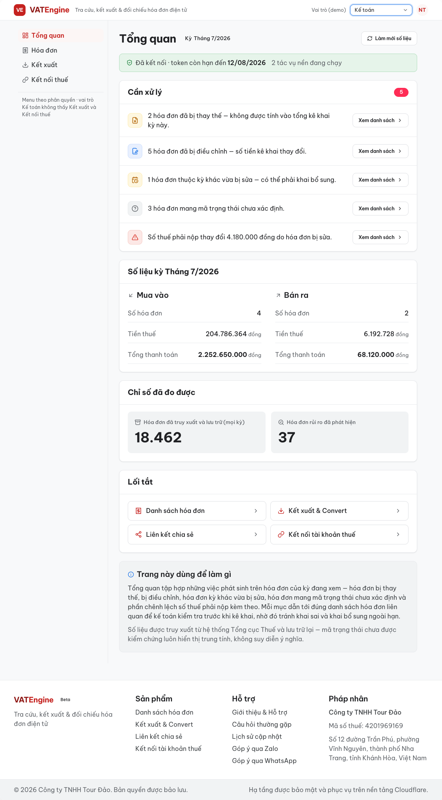
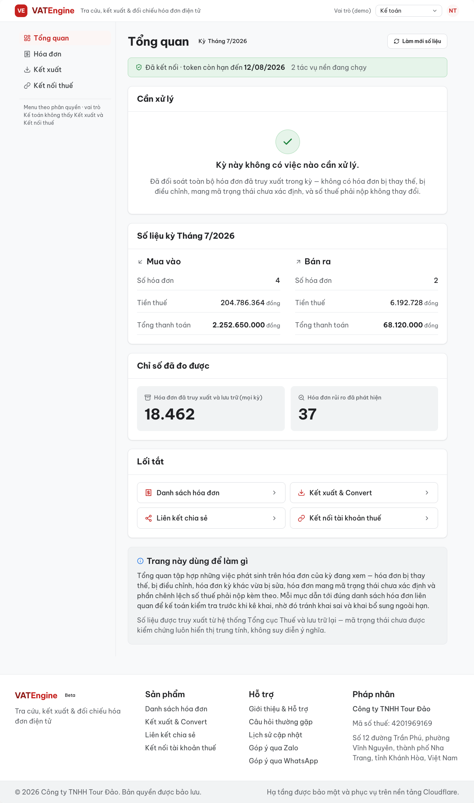
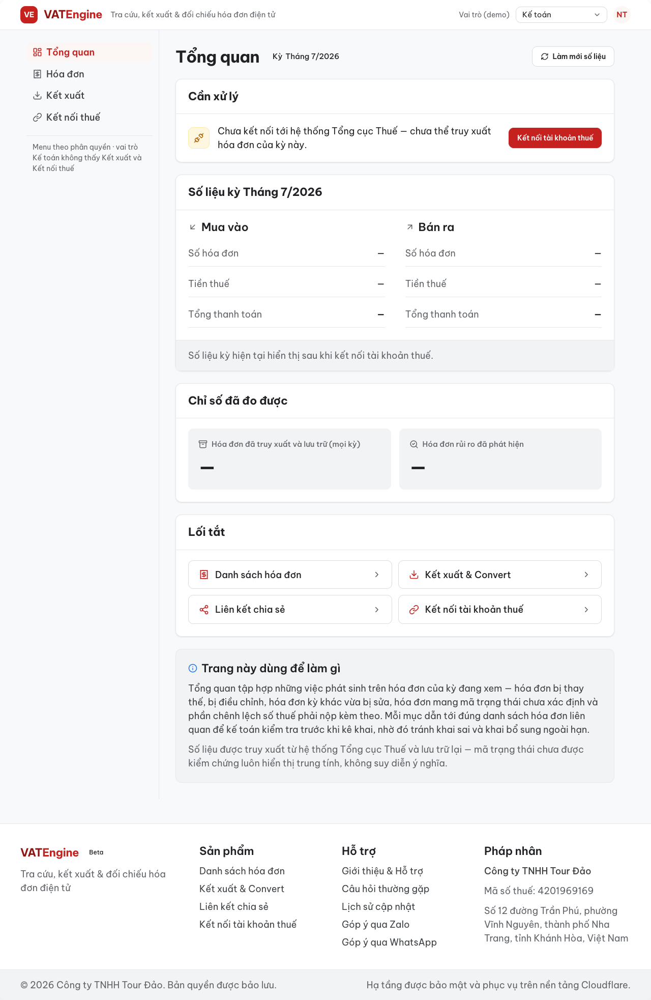
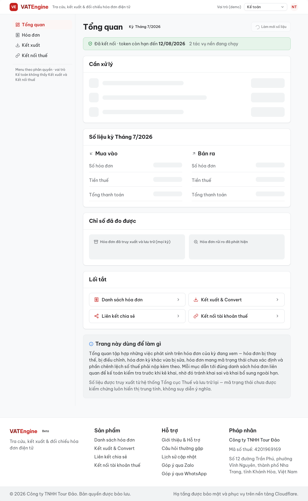
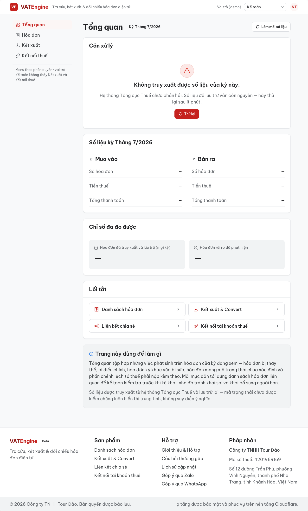
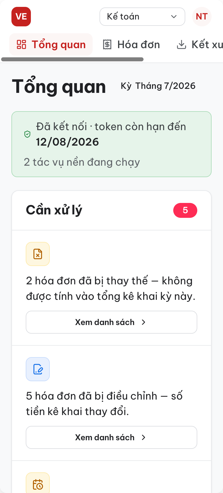
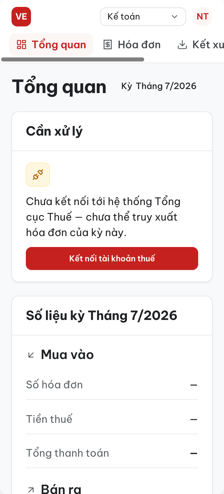
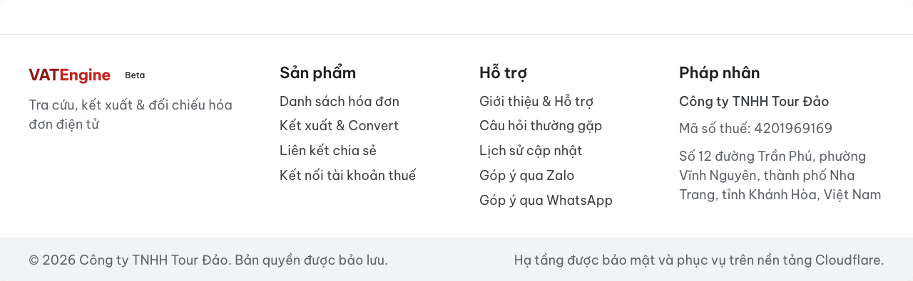
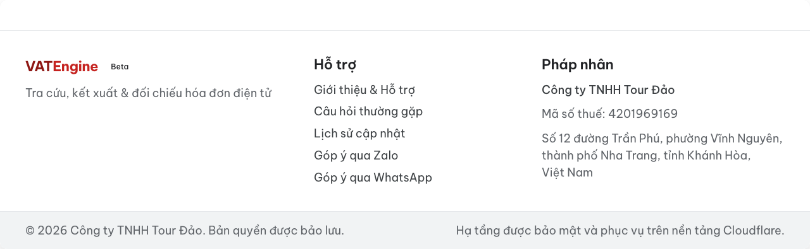

# Đặc tả — trang Tổng quan & Footer

VATEngine · phiên bản 30/07/2026 · dựng theo brief *Thiết kế lại trang Tổng quan & Footer*

| | |
|---|---|
| Tệp thiết kế | `ui_kits/web_app/DashboardScreen.jsx` · `ui_kits/web_app/Footer.jsx` |
| Dữ liệu mẫu | `ui_kits/web_app/dashboard-data.jsx` |
| Khung ứng dụng | `ui_kits/web_app/AppShell.jsx` — Footer nằm trong khung nên có ở mọi trang |
| Bản hẹp | `ui_kits/web_app/mobile.html` — 390 × 844 |
| Khổ desktop | 1280 · vùng nội dung tối đa `--container-max` 1200 · thanh trái `--sidebar-w` 248 |

---

## 1 · Trang Tổng quan — bảy khối

| Khối | Nội dung | Điều kiện hiện |
|---|---|---|
| 1 · Tiêu đề trang | “Tổng quan” `--fs-2xl` đậm + chip kỳ đang xem + nút “Làm mới số liệu” | Luôn hiện. Nút ẩn ở bản hẹp. |
| 2 · Dòng trạng thái kết nối | “Đã kết nối · token còn hạn đến {ngày}” + “{N} tác vụ nền đang chạy” | Chỉ khi kết nối lành mạnh. Ẩn ở trạng thái rỗng và lỗi. |
| 3 · Cần xử lý | Danh sách việc, mỗi việc một hành động. Xem mục 2. | Luôn hiện — thay nội dung theo trạng thái, không bao giờ để trắng. |
| 4 · Số liệu kỳ hiện tại | Hai cột Mua vào / Bán ra: số hóa đơn, tiền thuế, tổng thanh toán | Luôn hiện. Chưa kết nối hoặc lỗi thì giá trị là “—”. |
| 5 · Chỉ số đã đo được | Hóa đơn đã truy xuất và lưu trữ (mọi kỳ) · hóa đơn rủi ro đã phát hiện | Luôn hiện. |
| 6 · Lối tắt | Thẻ một dòng: nhãn + biểu tượng + mũi chỉ hướng | Lọc theo phân quyền. |
| 7 · Khối hướng dẫn cuối trang | Hai đoạn mô tả chức năng trang và nguồn số liệu | Luôn hiện. |

> **Không có chỗ để trưng:** danh sách nhà cung cấp rủi ro · biểu đồ theo chuỗi thời gian · lần đồng bộ gần nhất · hạn mức gói đã dùng · nhãn nghĩa của mã `ttxly`. Cũng không có chỉ số quy đổi kiểu “tiết kiệm ~N giờ”.

*Trạng thái **rảnh** — 1280px, vai trò Kế toán trưởng. Khối “Cần xử lý” đứng ngay dưới dòng trạng thái kết nối, trước mọi số liệu.*

---

## 2 · Khối “Cần xử lý” — nguyên tắc và biến thể

> **Không con số nào đứng một mình.** Mỗi dòng gồm ba phần: sự việc + hệ quả nghiệp vụ + một hành động. Chỉ hiện mục thật sự có; không có mục nào thì chuyển sang trạng thái trấn an, không hiện danh sách rỗng.

| Mục | Câu hiển thị | Hành động | Sắc độ |
|---|---|---|---|
| Chưa kết nối | Chưa kết nối tới hệ thống Tổng cục Thuế — chưa thể truy xuất hóa đơn của kỳ này. | Kết nối tài khoản thuế *(nút chính)* | `--warning-*` |
| Bị thay thế | {N} hóa đơn đã bị thay thế — không được tính vào tổng kê khai kỳ này. | Xem danh sách | `--warning-*` |
| Bị điều chỉnh | {N} hóa đơn đã bị điều chỉnh — số tiền kê khai thay đổi. | Xem danh sách | `--info-*` |
| Kỳ khác bị sửa | {N} hóa đơn thuộc kỳ khác vừa bị sửa — có thể phải khai bổ sung. | Xem danh sách | `--warning-*` |
| Mã trạng thái lạ | {N} hóa đơn mang mã trạng thái chưa xác định. | Xem danh sách | trung tính |
| Lệch số thuế phải nộp | Số thuế phải nộp thay đổi {số} đồng do hóa đơn bị sửa. | Xem danh sách | `--danger-*` |

**Quy tắc sắc độ:** `--danger-*` chỉ dùng cho dòng lệch số thuế phải nộp. `--warning-*` cho việc bỏ qua thì có hậu quả pháp lý. `--info-*` cho việc giải thích số liệu đã đổi. Mã chưa kiểm chứng luôn trung tính (`--surface-muted` + `--text-tertiary`), không tô màu gợi nghĩa. Chấm số đếm bên cạnh tiêu đề khối dùng `--notify-600` — token này không dùng ở bất kỳ chỗ nào khác trên trang.

### Cấu tạo một dòng

- Ô biểu tượng 40 × 40, `--radius-md`, nền và viền theo sắc độ của mục.
- Câu văn `--fs-base` (18px), `--text-primary`, chiếm hết phần giữa — không cắt ngắn, không nhét mô tả dài vào đây.
- Một nút bên phải. Nhãn là cụm động từ ngắn, không dấu chấm cuối. Nút phụ dùng `secondary` + mũi chỉ hướng; chỉ mục “Chưa kết nối” dùng nút `primary`.
- Các dòng cách nhau bằng đường `--border-subtle`, không dùng thẻ lồng thẻ.

---

## 3 · Bốn trạng thái

***Không có cảnh báo*** — dấu kiểm `--success-*`, câu “Kỳ này không có việc nào cần xử lý.” đặt ở `--fs-lg` đậm, kèm một câu nói rõ đã đối soát những gì. Đây là trạng thái trấn an, không phải trạng thái thiếu dữ liệu: các khối số liệu bên dưới vẫn đầy đủ.

***Rỗng — chưa kết nối tài khoản thuế*** (ấn tượng đầu tiên của khách mới). Dòng trạng thái kết nối biến mất; “Cần xử lý” còn một mục duy nhất với nút chính; số liệu kỳ hiện tại hiện “—” kèm một câu giải thích khi nào có số.

***Đang tải*** — khung xương đúng hình dạng ba dòng việc và các ô số, nhấp nháy nhẹ 1.4s. Dòng trạng thái kết nối vẫn hiện vì đã biết trước khi số liệu về. Nút “Làm mới số liệu” chuyển sang trạng thái đang chạy.

***Lỗi*** — “Không truy xuất được số liệu của kỳ này.” + một câu trấn an rằng số liệu đã lưu trữ vẫn còn + một hành động “Thử lại”. Không để màn trắng, không hiện mã lỗi kỹ thuật.

---

## 4 · Bản hẹp 390px

- Thanh điều hướng trái chuyển thành hàng cuộn ngang ngay dưới thanh đầu trang; thứ tự mục không đổi.
- Wordmark thu về dấu hiệu vuông; câu định vị sản phẩm và nhãn “Vai trò (demo)” ẩn.
- Mỗi dòng “Cần xử lý” xếp dọc: ô biểu tượng → câu văn → nút chiếm hết bề ngang (cao 40px, đạt ngưỡng chạm).
- Mua vào / Bán ra, chỉ số đo được và lối tắt đều về một cột. Footer xếp dọc bốn khối, dải đáy hai dòng.
- Cỡ chữ **không đổi** — câu văn vẫn 18px. Bản hẹp chỉ đổi bố cục, không bóp chữ.

| Rảnh | Rỗng, chưa kết nối |
|---|---|
|  |  |

*Cắt tại khối “Cần xử lý”. Ảnh toàn trang của cả hai trạng thái xem trong `mockup-sheet.html` (cùng thư mục).*

---

## 5 · Footer

*Footer đầy đủ — mọi trang sau đăng nhập.*

| Cột | Nội dung | Ghi chú |
|---|---|---|
| Thương hiệu | Wordmark VATEngine + nhãn Beta + “Tra cứu, kết xuất & đối chiếu hóa đơn điện tử” | Wordmark `--fs-lg` đậm; “VAT” dùng `--brand-ink`, “Engine” dùng `--brand-primary` |
| Sản phẩm | Danh sách hóa đơn · Kết xuất & Convert · Liên kết chia sẻ · Kết nối tài khoản thuế | Lọc theo phân quyền; vai trò Kế toán chỉ còn mục đầu |
| Hỗ trợ | Giới thiệu & Hỗ trợ · Câu hỏi thường gặp · Lịch sử cập nhật · Góp ý qua Zalo · Góp ý qua WhatsApp | Không lọc |
| Pháp nhân | Công ty TNHH Tour Đảo · Mã số thuế 4201969169 · địa chỉ đầy đủ | Mã số thuế dùng chữ số đều bề ngang |

**Dải đáy** nền `--surface-muted`, hai câu tách hai đầu: “© 2026 Công ty TNHH Tour Đảo. Bản quyền được bảo lưu.” và “Hạ tầng được bảo mật và phục vụ trên nền tảng Cloudflare.”

Ở màn **Đăng nhập** ẩn cột Sản phẩm — chưa đăng nhập thì mọi liên kết đó đều bật về màn đăng nhập, thành liên kết chết. Ba cột còn lại giãn đều.

**Liên kết:** `--fs-base`, màu `--text-secondary`, khi trỏ vào đổi sang `--text-link` trong `--dur-fast`. Không gạch chân mặc định. Tiêu đề cột `--fs-lg` nửa đậm — lớn hơn thân, không viết hoa toàn phần.

---

## 6 · Token đã dùng

| Nhóm | Token |
|---|---|
| Cỡ chữ | `--fs-2xl` tiêu đề trang · `--fs-lg` tiêu đề khối · `--fs-base` mọi câu văn · `--fs-sm`/`--fs-xs` chỉ cho nhãn · `--fs-3xl` số liệu tiêu điểm |
| Thương hiệu | `--brand-primary` · `--brand-ink` · `--brand-50` · `--surface-selected` |
| Cảnh báo | `--danger-600`/`-50`/`-200` · `--warning-700`/`-50`/`-200` · `--info-600`/`-50`/`-200` · `--success-600`/`-50`/`-200` |
| Số đếm | `--notify-600` · `--notify-fg` |
| Nền & viền | `--surface-page` · `--surface-card` · `--surface-muted` · `--surface-hover` · `--border` · `--border-subtle` · `--border-strong` |
| Khoảng cách | `--sp-1` → `--sp-12` |
| Bo góc & bóng | `--radius-sm` · `--radius-md` · `--radius-lg` · `--radius-pill` · `--radius-full` · `--shadow-sm` |
| Chuyển động | `--dur-fast` · `--ease-standard` |
| Số liệu | `--numeric-tabular` — mọi số tiền, mã số thuế, số hóa đơn đều căn phải |

### Token còn thiếu — cần chốt trước khi chuyển sang mã sản phẩm

1. **Chiều cao thanh đầu trang.** `--header-h` cố ý không có trong token. Bản dựng hiện tại để padding + nội dung quyết định. Muốn cố định thì phải đo trên bản chạy thật rồi khai.
2. **Kích thước ô biểu tượng.** Ô 40 / 56 / 64px trong các khối trạng thái là số hình học viết trực tiếp, chưa có thang `--icon-box-*`.
3. **Component 14/07 gọi token đã bị bỏ.** `Alert.jsx` gọi `--sky-100`, `--green-100`, `--amber-100`, `--red-100`, `--red-500`, `--gray-800`; `Button.jsx` gọi `--red-600` và `--blue-50`; `Card.jsx` gọi `--blue-50`. Vì vậy trang Tổng quan không dùng `Alert` và `StatCard` mà dựng thẳng bằng token canonical. Cần một phiên riêng để sửa loạt component này.

---

## 7 · Văn phong đã áp dụng

- Dùng “truy xuất / tải về”, “tệp”, “liên kết”, “hệ thống Tổng cục Thuế”, “Tổng thanh toán”, “mã số thuế”, “hóa đơn điện tử”, “người mua”.
- Viết sentence case, nhấn mạnh bằng chữ đậm, không viết hoa toàn phần, không dấu chấm than, không biểu tượng cảm xúc.
- Gạch ngang dài giữa hai vế câu — trong mọi câu của khối “Cần xử lý”.
- Nhãn nút là cụm động từ ngắn, không dấu chấm cuối: “Xem danh sách”, “Kết nối tài khoản thuế”, “Thử lại”, “Làm mới số liệu”.
- Mô tả dài chỉ nằm ở khối hướng dẫn cuối trang, không nhét vào thẻ hành động, không giấu trong tooltip.

---

## 8 · Ngoài phạm vi

Trang **Đối chiếu** không được thiết kế và đã rút khỏi thanh điều hướng — không màn nào dẫn tới trang đó. Tệp `ReconcileScreen.jsx` cũ vẫn nằm trong dự án nhưng không còn được gọi.
